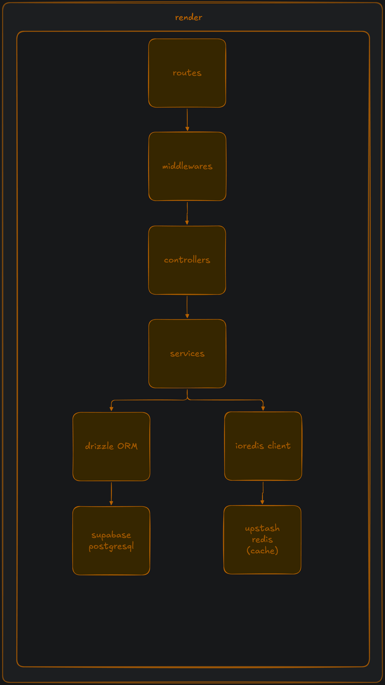

# Blinky

API REST para gerenciamento de links de campanha com parâmetros dinâmicos.

## Stack

- **Node.js + TypeScript + Express**
- **PostgreSQL** com **Drizzle ORM**
- **Redis** para cache
- **JWT** para autenticação
- **Zod** para validação
- **Docker** para infraestrutura local

## Rodando o projeto

### Pré-requisitos

- [Docker](https://docs.docker.com/get-docker/)
- [Bun](https://bun.sh/)

### Setup

```bash
# 1. Clone e instale as dependências
bun install

# 2. Configure as variáveis de ambiente
cp .env.example .env
# Edite o .env com suas configurações

# 3. Suba o banco e o Redis via Docker
cd docker && docker compose up -d

# 4. Rode as migrations
bun run db:migrate

# 5. Suba o servidor
bun run dev
```

O servidor vai responder em `http://localhost:3333`.

A documentação interativa está disponível em `http://localhost:3333/docs`.

## Endpoints

| Método | Rota | Descrição |
|--------|------|-----------|
| POST | `/api/auth/register` | Criar conta |
| POST | `/api/auth/login` | Autenticar |
| GET/POST | `/api/projects` | Listar / criar projetos |
| GET/PUT/DELETE | `/api/projects/:id` | Gerenciar projeto |
| GET/POST | `/api/links` | Listar / criar links |
| GET/PUT/DELETE | `/api/links/:id` | Gerenciar link |
| **GET** | **`/api/links/:id/generate`** | **Gerar URL final** |
| POST/DELETE | `/api/links/:id/parameters` | Associar / remover parâmetro |
| POST/PUT/DELETE | `/api/links/:id/redirect` | Gerenciar redirect do link |
| GET/POST | `/api/parameters` | Listar / criar parâmetros |
| DELETE | `/api/parameters/:id` | Remover parâmetro |

Todas as rotas (exceto auth) exigem `Authorization: Bearer <token>`.

---

## Arquitetura



## Respostas conceituais

### 1. Como modelei as entidades?

Separei o que um link **é** do que ele **carrega**. A URL base e o nome ficam no link em si, e os parâmetros vivem em uma tabela própria com relacionamento N:N.

```
users
  └── projects
        └── links
              ├── links_parameters (N:N) ──→ parameters
              └── redirects (1:1)
```

- **users** → autenticação e isolamento de dados
- **projects** → agrupamento lógico de links (ex: "Campanha Q2", "Produto X")
- **links** → o template do link, com `name` e `baseUrl`
- **parameters** → pares `key/value` que pertencem ao usuário, não ao link
- **links_parameters** → pivot N:N entre links e parâmetros
- **redirects** → URL de destino opcional, 1:1 com o link

Modelar os parâmetros como N:N foi a decisão central. Um `utm_source=facebook` pode ser criado uma vez e reutilizado em quantos links precisar, sem duplicar dado nenhum.

### 2. Quais decisões tomei e por quê?

**Drizzle no lugar do Prisma:** preferi porque as queries ficam em TypeScript puro, sem ter que aprender uma DSL própria. As migrations também são mais previsíveis.

**Parâmetros reutilizáveis (N:N):** se cada link tivesse seus próprios parâmetros, trocar `utm_source=google` para `bing` em 200 links seria inviável. Com N:N, mudo uma linha e todos os links já refletem.

**Cache no `/generate`:** esse endpoint faz três queries (link, parâmetros e redirect). Como pode ser chamado com frequência, cachear por 5 minutos faz sentido. Invalido o cache sempre que algo muda, então não tem risco de retornar dado desatualizado.

**JWT sem refresh token:** para o escopo desse projeto é suficiente. Adicionar refresh token ia aumentar a complexidade sem contribuir para o que está sendo avaliado.

**Zod para validação:** além de barrar entrada inválida, os schemas funcionam como documentação do contrato de cada rota. Ficam em arquivos separados por domínio, fácil de encontrar e alterar.

### 3. Como isso resolve o problema de escala?

O problema é simples: editar parâmetros em muitos links um a um não escala.

Minha solução é que o parâmetro existe independente do link. Associo ele a quantos links precisar, e quando o valor muda, atualizo só o parâmetro. Na próxima chamada ao `/generate`, todos os links já saem com o valor novo, o cache invalida automaticamente.

Não preciso tocar em link nenhum individualmente.
